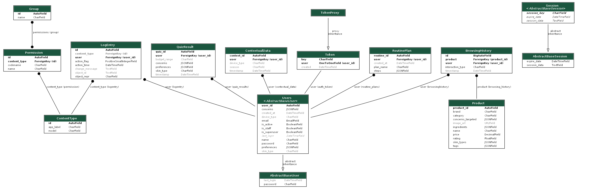

# skincare-recommender
A skincare recommendation system with product catalog, filtering, personalized routines, and a basic recommendation engine.

Data model diagrams
API reference
1. Register - ثبت‌نام کاربر جدید
Endpoint: POST /api/register/
Request Body:
{
  "email": "user@example.com",
  "password": "password123",
  "name": "username",
  "skin_type": "dry",
  "concerns": ["acne", "aging"],
  "preferences": ["vegan", "cruelty_free"],
  "device_type": "mobile"
}
Response:
•	201 Created - Successful
{
  "success": true,
  "message": "User created successfully",
  "user": {
    "user_id": 1,
    "email": "user@example.com",
    "name": "username",
    "skin_type": "dry"
  }
}
•	400 Bad Request - Error
{
  "success": false,
  "error": "User already exists"
}

2. Login - ورود کاربر
Endpoint: POST /api/login/
Request Body:
{
  "email": "user@example.com",
  "password": "password123"
}
Response:
•	200 OK -Successful 
{
  "success": true,
  "message": "Login successful",
  "token": "abc123token456",
  "user": {
    "user_id": 1,
    "email": "user@example.com",
    "name": "username",
    "skin_type": "dry"
  }
}
•	401 Unauthorized - Error
{
  "success": false,
  "error": "Invalid credentials"
}

Product Endpoints
3. Product List - لیست محصولات
Endpoint: GET /api/products/
Headers:Authorization: Token abc123token456
Response:
{
  "count": 100,
  "next": "http://api.example.com/products/?page=2",
  "previous": null,
  "results": [
    {
      "product_id": 1,
      "name": "کرم مرطوب کننده",
      "description": "توضیحات محصول",
      "price": "250000",
      "category": 1,
      "skin_type": "dry",
      "ingredients": "مواد تشکیل دهنده",
      "usage_instructions": "دستورالعمل استفاده",
      "image": "/media/products/cream.jpg"
    }
  ]
}
4. Product Detail - جزئیات محصول
Endpoint: GET /api/products/{product_id}/
Response:
{
  "product_id": 1,
  "name": "کرم مرطوب کننده",
  "description": "توضیحات کامل محصول",
  "price": "250000",
  "category": 1,
  "skin_type": "dry",
  "ingredients": "مواد تشکیل دهنده",
  "usage_instructions": "دستورالعمل استفاده",
  "image": "/media/products/cream.jpg",
  "created_at": "2024-01-15T10:30:00Z"
}
5. Create Product - ایجاد محصول جدید
Endpoint: POST /api/products/create/
Headers:  Authorization: Token abc123token456
Request Body (FormData):
•	name (required) - نام محصول
•	description (required) - توضیحات
•	price (required) - قیمت
•	category (required) - دسته‌بندی
•	skin_type (required) - نوع پوست
•	ingredients - مواد تشکیل دهنده
•	usage_instructions - دستورالعمل
•	image - تصویر محصول
Response:
•	201 Created - موفق
{
  "product_id": 1,
  "name": "کرم جدید",
  "price": "300000",
  "message": "Product created successfully"
}
📊 Interaction Endpoints
6. Log Interaction - ثبت تعامل کاربر
Endpoint: POST /api/interactions/log/
Headers: Authorization: Token abc123token456
Request Body:
{
  "product_id": 1,
  "interaction_type": "view"
}
Interaction Types:
•	view - مشاهده محصول
•	click - کلیک روی محصول
•	purchase - خرید محصول
•	wishlist - افزودن به لیست علاقه‌مندی
Response:
•	201 Created - موفق
{
  "status": "Interaction logged successfully."
}
🎯 Recommendation Endpoints
7. Get Recommendations - دریافت پیشنهادات
Endpoint: GET /api/recommendations/
Headers: Authorization: Token abc123token456
Query Parameters:
•	limit - تعداد پیشنهادات (default: 10, max: 50)
•	season - فصل (summer, winter, etc.)
•	device - نوع دستگاه (mobile, desktop)
Response:
{
  "count": 10,
  "context": {
    "season": "winter",
    "device": "mobile"
  },
  "recommendations": [
    {
      "product_id": 1,
      "name": "کرم زمستانی",
      "price": "350000",
      "reason": "Based on your skin type and winter season"
    }
  ]
}
📝 Quiz Endpoints
8. Get Quiz Questions - دریافت سوالات کوییز
Endpoint: GET /api/quiz/questions/
Headers:Authorization: Token abc123token456
Response:
{
  "success": true,
  "questions": [
    {
      "question_id": 1,
      "question_text": "What is your skin type?",
      "question_type": "single",
      "options": [
        {"value": "oily", "text": "Oily", "related_field": "skin_type"}
      ]
    }
  ],
  "total_questions": 4
}
9. Submit Quiz Answers - ارسال پاسخ‌های کوییز
Endpoint: POST /api/quiz/submit/
Headers:Authorization: Token abc123token456
Request Body:
{
  "answers": {
    "skin_type": "dry",
    "concerns": ["acne", "aging"],
    "preferences": ["vegan"],
    "budget_range": "medium"
  }
}
Response:
•	201 Created - موفق
{
  "success": true,
  "message": "Quiz submitted successfully",
  "quiz_id": 123,
  "results": {
    "skin_type": "dry",
    "concerns": ["acne", "aging"],
    "preferences": ["vegan"],
    "budget_range": "medium"
  }
}
10. Get Quiz Results - دریافت نتایج کوییز
Endpoint: GET /api/quiz/results/
Headers:Authorization: Token abc123token456
Response:
{
  "success": true,
  "count": 3,
  "results": [
    {
      "quiz_id": 123,
      "skin_type": "dry",
      "concerns": ["acne"],
      "preferences": ["vegan"],
      "budget_range": "medium",
      "timestamp": "2024-01-15T10:30:00Z"
    }
  ]
}
🗓️ Routine Endpoints
11. Generate Routine - ایجاد روتین مراقبتی
Endpoint: POST /api/routines/generate/
Headers:Authorization: Token abc123token456
Request Body:
{
  "quiz_data": {
    "skin_type": "dry",
    "concerns": ["aging"]
  }
}
Response:
•	201 Created - موفق
{
  "success": true,
  "message": "Routines generated successfully",
  "data": [
    {
      "routine_id": 1,
      "plan_name": "روتین صبحگاهی",
      "steps": [
        {"product_id": 1, "step": 1, "instructions": "تمیز کردن"}
      ]
    }
  ]
}
12. Get User Routines - دریافت روتین‌های کاربر
Endpoint: GET /api/routines/
Headers:Authorization: Token abc123token456
Response:
{
  "success": true,
  "count": 2,
  "routines": [
    {
      "routine_id": 1,
      "plan_name": "روتین صبحگاهی",
      "steps": [
        {"product_id": 1, "step": 1}
      ],
      "created_at": "2024-01-15T10:30:00Z",
      "user_email": "user@example.com"
    }
  ]
}
13. Get Routine Detail - جزئیات روتین
Endpoint: GET /api/routines/{routine_id}/
Headers:Authorization: Token abc123token456
Response:
{
  "success": true,
  "routine": {
    "routine_id": 1,
    "plan_name": "روتین صبحگاهی",
    "steps": [
      {
        "product_id": 1,
        "product_name": "کرم مرطوب کننده",
        "step": 1,
        "instructions": "صبح ها استفاده شود"
      }
    ],
    "created_at": "2024-01-15T10:30:00Z"
  }
}
14. Delete Routine - حذف روتین
Endpoint: DELETE /api/routines/{routine_id}/
Headers:Authorization: Token abc123token456
Response:
•	200 OK - موفق
{
  "success": true,
  "message": "Routine deleted successfully"
}

Permission Requirements
•	عمومی: Register, Login
•	نیاز به احراز هویت: تمام endpoints به جز Register/Login
•	مدیریتی: Create Product (فقط ادمین)
Error Responses
Common Error Format:
{
  "success": false,
  "error": "Error message description"
}
Status Codes:
•	400 Bad Request - داده‌های ورودی نامعتبر
•	401 Unauthorized - توکن معتبر ارائه نشده
•	403 Forbidden - دسترسی غیرمجاز
•	404 Not Found - منبع یافت نشد
•	500 Internal Server Error - خطای سرور

دستورالعمل اجرای پروژه و تست (به سبک جنگو)
اجرای پروژه (Running)
1.	ابتدا مطمئن شوید Python 3 و pip روی سیستم شما نصب باشد.
2.	وابستگی‌های پروژه را نصب کنید:
3.	pip install -r requirements.txt
4.	مهاجرت‌های پایگاه داده را اعمال کنید:
5.	python manage.py migrate
6.	(اختیاری) ساخت کاربر ادمین برای ورود به پنل مدیریتی:
7.	python manage.py createsuperuser
8.	اجرای سرور توسعه:
9.	python manage.py runserver
حالا پروژه روی آدرس زیر در دسترس خواهد بود:
http://127.0.0.1:8000
تست پروژه (Testing)
برای اجرای تست‌های خودکار جنگو:
python manage.py test
اگر پروژه از  pytest یا ابزار تست دیگری استفاده کرده باشد، دستور می‌تواند به شکل زیر باشد:
pytest

توضیح مختصر recommendation system:
الف) پایگاه محتوا (Content-Based) - 50% وزن
ورودی‌ها:
•	تاریخچه بازدید کاربر: محصولاتی که کاربر مشاهده کرده است
•	نتایج کوئیز: اطلاعات پوستی و ترجیحات کاربر از پرسشنامه
•	ویژگی‌های محصول: دسته‌بندی، نوع پوست هدف، مواد تشکیل‌دهنده
استفاده از شباهت کسینوسی بین بردار فیچر ها
ایجاد ماتریس ویژگی‌ها
feature_text = f"{product.category} {product.skin_types} {product.concerns_targeted} {product.ingredients}"
feature_matrix = self.vectorizer.fit_transform(features)

شباهت کسینوسی محاسبه می کنیم
similarity_scores = cosine_similarity(user_profile, feature_matrix)
مراحل پردازش:
1.	استخراج ویژگی‌ها: تبدیل ویژگی‌های متنی محصولات به بردار عددی
2.	ساخت پروفایل کاربر: میانگین بردارهای محصولات مشاهده شده توسط کاربر
3.	محاسبه شباهت: اندازه‌گیری شباهت بین پروفایل کاربر و تمام محصولات
یه سری مزایا مثل عدم نیاز به داده سایر کاربران عملکرد خوب برای کاربران جدید و تازه وارد و یک سری معایب محدود به محتوای موجود و اینکه سلیقه‌های جدید و کشف نمی کنه

ب) فیلتر مشارکتی (Collaborative) - 30% وزن
ورودی:
•	رفتار کاربران مشابه: تاریخچه مشاهده کاربران با سلیقه مشابه
•	تعاملات: محصولاتی که کاربران مشابه دیده‌اند
تکنیک: User-User Similarity
شباهت جاکارد بین کاربران حساب می کنیم
intersection = len(user_viewed_products.intersection(other_viewed))
union = len(user_viewed_products.union(other_viewed))
similarity = intersection / union if union > 0 else 0
مراحل پردازش:
1.	یافتن کاربران مشابه: محاسبه شباهت بر اساس محصولات مشاهده شده
2.	جمع‌آوری رفتار: جمع‌آوری محصولات پرطرفدار در میان کاربران مشابه
3.	امتیازدهی: تعداد دفعات مشاهده هر محصول توسط کاربران مشابه
معیار شباهت : Jaccard Similarity
Jaccard(A,B) = |A ∩ B| / |A ∪ B|    Aمجموعه محصولات مشاهده شده توسط کاربر فعلی B مجموعه محصولات مشاهده شده توسط کاربر دیگر مقدار بین 0 تا 1: هرچه نزدیک‌تر به 1، شباهت بیشتر
این هم باز یک سری مزایا داره مثل کشف محتوای جدید بر اساس جامعه و عملکرد عالی با داده کافی و شخصی‌سازی قوی و یک سری معایب مثل مشکل Cold Start برای کاربران جدید نیاز به حجم زیاد داده پیچیدگی محاسباتی

 ج) زمینه‌ای (Contextual) - 20% وزن
فاکتورهای موثر:
1. فصل سال (Seasonal)
seasonal_keywords = {
    'summer': ['sunscreen', 'spf', 'lightweight', 'gel', 'oil-free'],
    'winter': ['hydrating', 'cream', 'rich', 'moisturizing', 'balm'],
    'spring': ['lightweight', 'refreshing', 'toner', 'serum'],
    'fall': ['repair', 'serum', 'moisturizer', 'treatment']
}
2. نوع دستگاه (Device)
•	موبایل: محصولات سریع و ساده (پاک کننده، مرطوب کننده)
•	دسکتاپ: محصولات تخصصی و تحقیقی
3. شرایط محیطی  
•	آب و هوا
•	موقعیت جغرافیایی
•	ساعت روز
الگوریتم وزندهی زمینه‌ای:
if season and self.is_seasonal_product(product, season):
  scores[i] *= 1.5  افزایش 50% امتیاز برای محصولات مخصوص هر فصل
if device == 'mobile' and product.category in ['cleanser', 'moisturizer']:
    scores[i] *= 1.3  # افزایش 30% امتیاز برای محصولات موبایل-فرندلی
این هم یک سری مزایا مثل در نظر گیری شرایط واقعی کارب رو افزایش relevancy پیشنهادات وانعطاف‌پذیری بالا و یک سری معایب مثل نیاز به داده زمینه‌ای دقیق وپیچیدگی در جمع‌آوری context

امتیاز نهایی = (0.5 × امتیاز محتوا) + (0.3 × امتیاز مشارکتی) + (0.2 × امتیاز زمینه‌ای) به اون تعداد که میخوایم پیشنهاد بدیم از بیشترین امتیاز ها انتخاب میکنیم

توضیح مختصر Routine Builde:
سیستم Routine Builder یک موتور هوشمند برای ایجاد روتین های شخصی‌سازی شده مراقبت پوست است که بر اساس پروفایل کاربر، ترجیحات و محصولات موجود، برنامه‌های کامل مراقبتی تولید می‌کند.
اهداف سیستم
•	ایجاد روال‌های مراقبت پوست شخصی‌سازی شده
•	ارائه چندین گزینه بر اساس سبک زندگی کاربر
•	یکپارچه‌سازی با سیستم پیشنهاد‌دهی
•	ذخیره و مدیریت روال‌های کاربران
1. ساختار روتین ها
ROUTINE_STEPS = {
    'full': ['cleanser', 'toner', 'serum', 'moisturizer', 'sunscreen'],
    'hydration': ['cleanser', 'serum', 'moisturizer'],
    'minimalist': ['cleanser', 'moisturizer', 'sunscreen']
}
2. انواع روتین ‌ها
•	Complete Care (5 مرحله): کامل‌ترین روال
•	Hydration Boost (3 مرحله): تمرکز بر آبرسانی
•	Essential Minimal (3 مرحله): روتین سریع و ضروری
مراحل تولید روتین
1 .دریافت داده‌های کاربر
def get_quiz_data(self, user):
 دریافت آخرین نتایج کوئیز کاربر
.2 فیلتر کردن محصولات
def filter_by_quiz_preferences(self, products, quiz_data):
  فیلتر بر اساس نوع پوست و نگرانی‌ها
.3 انتخاب محصولات
def get_product_for_step(self, user, step, quiz_data):
 انتخاب محصول مناسب برای هر مرحله
4. ذخیره روال
def save_routine_plan(self, user, plan_type, steps):
  ذخیره روال در دیتابیس
الگوریتم انتخاب محصول
مراحل انتخاب:
1.	فیلتر اولیه بر اساس دسته‌بندی
2.	فیلتر پیشرفته بر اساس پروفایل کاربر
3.	دریافت پیشنهادات از سیستم  recommender
4.	 Fallback به انتخاب تصادفی در صورت نیاز
فیلترهای اعمال شده:
skin_match = quiz_data['skin_type'] in product.skin_types
concerns_match = any(concern in product_concerns for concern in user_concerns)
 ساختار خروجی
{
  "plan_name": "full",
  "plan_display_name": "Complete Care Routine",
  "steps": [
    {
      "step": "cleanser",
      "product_name": "Hydrating Cleanser",
      "instructions": "Apply to damp skin...",
      "category": "cleanser"
    }
  ],
  "total_steps": 5,
  "estimated_time": "10-15 minutes"
}
یکپارچه‌سازی با سیستم‌های دیگر
با Recommender System:
recommended = self.recommender.get_recommendations(
    user=user,
    num_recommendations=5,
    context={'season': 'general'}
)
با مدل‌های دیتابیس:
•	Product: اطلاعات محصولات
•	QuizResult: ترجیحات کاربر
•	RoutinePlan: ذخیره روال‌ها
•	Users: پروفایل کاربران
یکی از ویژگی‌های کلیدی ان ارائه 3 گزینه مختلف و دستورالعمل‌های آموزشی
STEP_INSTRUCTIONS = {
    'cleanser': "Apply to damp skin, massage gently...",
    'toner': "Apply with a cotton pad...",
     ...}
مدیریت خطاها
•	Fallback به محصولات تصادفی
•	handling عدم وجود داده کوئیز
•	مدیریت محصولات ناموجود
